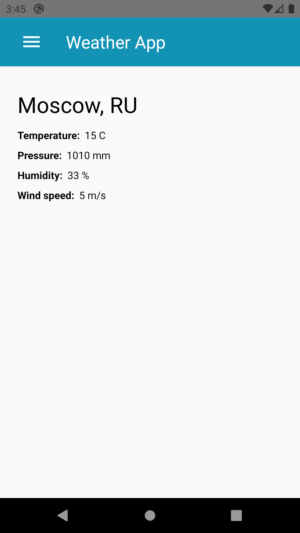
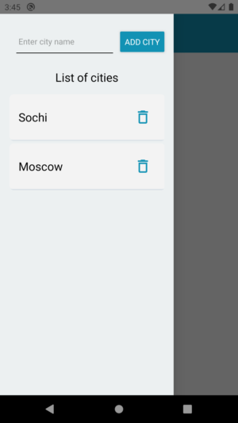

# Weather App

> Приложения для получения погоды - температуры и влажности воздуха, атмосферное давление, ветер и дождь.

Вы можете задать список мест, погода в которых вас интересует, и быстро переключаться между ними или получить погоду по вашему местоположению.

 

## Installation

Перед установкой **необходимо настроить рабочую среду** в соответсвии с https://reactnative.dev/docs/environment-setup

```sh
git clone https://github.com/chskela/weatherApp
cd weatherApp
npm install
npm run react-native run-android
npm run react-native start
```

## Development setup

**Шаг 1. Запустите метро**

Вам нужно будет запустить Metro, сборщик JavaScript, который поставляется с React Native. Чтобы запустить Metro, запустите npx response-native start в папке проекта React Native:

```sh
npm run react-native start
```

**Шаг 2. Запустите приложение**

Пусть Metro Bundler работает в собственном терминале. Откройте новый терминал в папке проекта React Native. Выполните следующее:

```sh
npm run react-native run-android
```

Если все настроено правильно, вскоре вы увидите, что приложение будет запущено в эмуляторе Android.

## Meta

Алексей Чистяков – chskela@gmail.com
